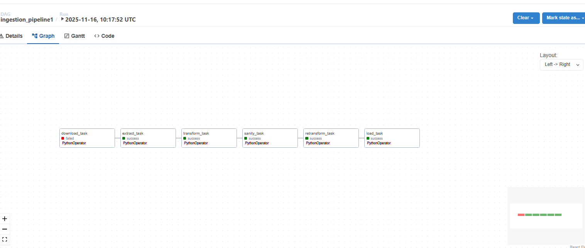

# RAINA

[](LICENSE)


---

## Application Preview

</img>

---

## Project Insight

RAINA is an open-source pipeline for ingestion, semantic search, and retrieval-augmented generation (RAG). It addresses the challenge of organizing and querying large volumes of university-related information. The system integrates modern AI and data infrastructure to provide efficient retrieval and contextual responses.

---

## Why This Project Exists

RAINA version 1 was originally developed for the _**University of Sistan and Baluchestan**_ to streamline access to university documentation. Traditional search methods are limited in semantic understanding and context-awareness. RAINA solves this by combining embeddings, vector storage, and full-text indexing, enabling precise, context-aware queries for students and administrators.

---

## Architecture & Technologies

| Component | Technology | Purpose |
|-----------|------------|---------|
| Ingestion & Workflow | Airflow | Orchestrates document ingestion and pipeline tasks |
| Full-text Search | Elasticsearch | Indexes documents for fast retrieval |
| Vector Store | ChromaDB | Stores embeddings for semantic search |
| Embeddings & LLM | Ollama | Generates vector embeddings and provides local LLM support |
| API Gateway | FastAPI | Exposes endpoints for semantic search and RAG |
| Metadata Storage | PostgreSQL | Stores pipeline metadata and logs |

Core runtime requirements: Python 3.9+, Docker, FastAPI, Airflow, ChromaDB, Elasticsearch, Ollama

---

## Run It Locally

```bash
git clone https://github.com/yourusername/raina.git
cd raina
docker compose up -d
````

Ensure required ports are free:

* ChromaDB → 8800
* Elasticsearch → 9200
* Ollama → 11434
* FastAPI → 8000
* Airflow → 8080
* Kibana → 5601

Optionally configure environment variables in `.env` for custom API URLs or ports.

---

## Key Takeaways

* Integrated pipeline combining ingestion, semantic search, and RAG
* Local LLM support using Ollama for embedding and query generation
* Efficient vector and full-text storage for hybrid search
* Modular architecture enables extension and research experiments

---

## Roadmap

* Add multi-language support for documents and queries
* Improve embedding and RAG response performance
* Implement user-friendly dashboard for monitoring ingestion and search metrics

---

**Keywords:** Semantic Search, RAG, Python, FastAPI, Airflow, ChromaDB, Elasticsearch, Local LLM

